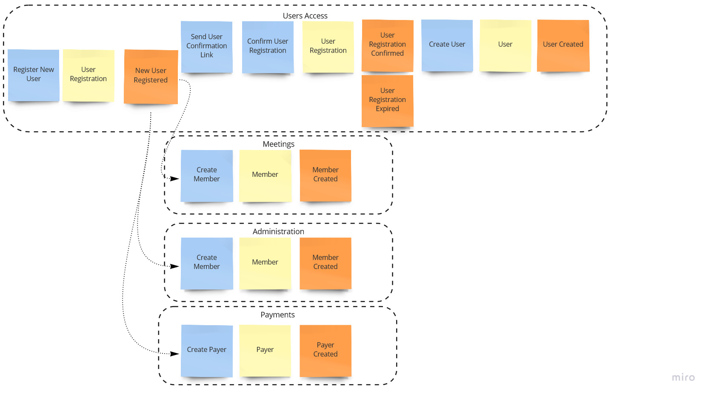
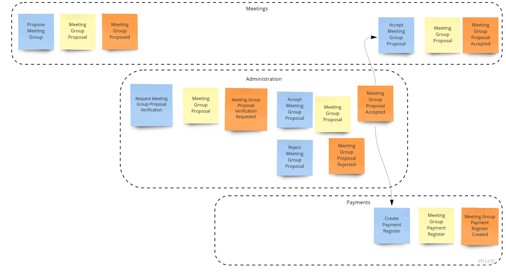
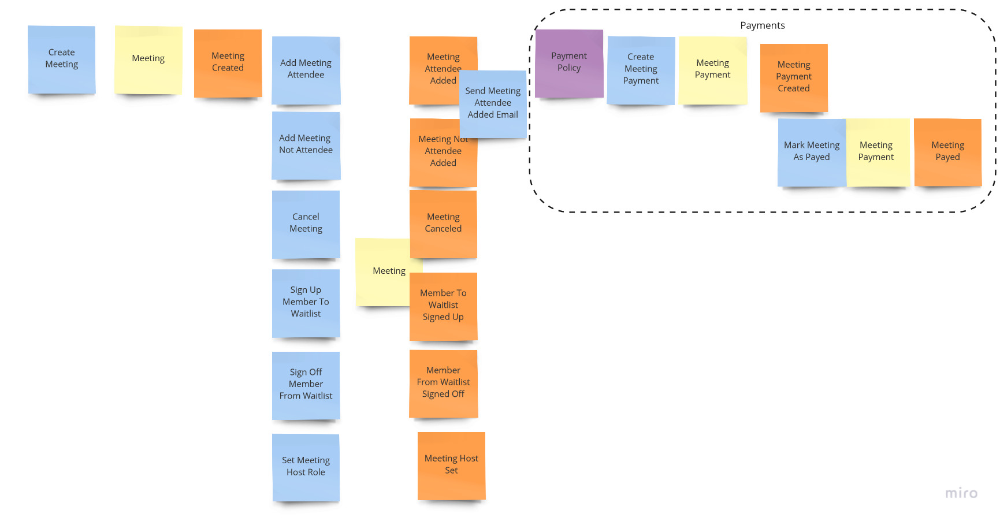

### python-clean-architecture
## Description of the Example Application

This description is largely based on the architectural analysis made by © Kamil Grzybek (2020) at the  [Modular Monolith with DDD](https://github.com/kgrzybek/modular-monolith-with-ddd) Project. The places where `python-clean-architecture` library has made its changes are marked with **`[PCA]`** marker.

### Domain

#### Definition

> Domain - A sphere of knowledge, influence, or activity. The subject area to which the user applies a program is the domain of the software.
>
> — Eric Evans (2015), [Domain-Driven Design Reference](http://domainlanguage.com/ddd/reference/)

The **Meeting Groups** domain was selected for the purposes of this project based on the [Meetup.com](https://www.meetup.com/) system.

#### Main reasons for selecting this domain

- It is common, a lot of people use the Meetup site to organize or attend meetings
- There is a system for it, so everyone can check this implementation against a working site which supports this domain
- It is not complex so it is easy to understand
- It is not trivial - there are some business rules and logic and it is not just CRUD operations
- You don't need much specific domain knowledge unlike other domains like financing, banking, medical
- It is not big so it is easier to implement

#### Meetings

The main business entities are `Member`, `Meeting Group` and `Meeting`. A `Member` can create a `Meeting Group`, be part of a `Meeting Group` or can attend a `Meeting`.

A `Meeting Group Member` can be an `Organizer` of this group or a normal `Member`.

Only an `Organizer` of a `Meeting Group` can create a new `Meeting`.

A `Meeting` has attendees, not attendees (`Members` which declare they will not attend the `Meeting`) and `Members` on the `Waitlist`.

A `Meeting` can have an attendee limit. If the limit is reached, `Members` can only sign up to the `Waitlist`.

A `Meeting Attendee` can bring guests to the `Meeting`. The number of guests allowed is an attribute of the `Meeting`. Bringing guests can be unallowed.

A `Meeting Attendee` can have one of two roles: `Attendee` or `Host`. A `Meeting` must have at least one `Host`. The `Host` is a special role which grants permission to edit `Meeting` information or change the attendees list.

#### Administration

To create a new `Meeting Group`, a `Member` needs to propose the group. A `Meeting Group Proposal` is sent to `Administrators`. An `Administrator` can accept or reject a `Meeting Group Proposal`. If a `Meeting Group Proposal` is accepted, a `Meeting Group` is created.

#### Payments

To be able to organize `Meetings`, the `Meeting Group` must be paid for. The `Meeting Group` `Organizer` who is the `Payer`, must pay some fee according to a payment plan.

Additionally, Meeting organizer can set an `Event Fee`. Each `Meeting Attendee` is obliged to pay the fee. All guests should be paid by `Meeting Attendee` too.

#### Users

Each `Administrator`, `Member` and `Payer` is a `User`. To be a `User`, `User Registration` is required and confirmed.

Each `User` is assigned one or more `User Role`.

Each `User Role` has set of `Permissions`. A `Permission` defines whether `User` can invoke a particular action.

### Conceptual Model

#### Definition

> Conceptual Model - A conceptual model is a representation of a system, made of the composition of concepts that are used to help people know, understand, or simulate a subject the model represents.
>
> [Wikipedia - Conceptual model](https://en.wikipedia.org/wiki/Conceptual_model)

#### The Conceptual Model

© Kamil Grzybek (2020)

#### The Command-Event Model

Three core processes have their behavior described with Event Storming: `User Registration`, `Meeting Group Creation` and `Meeting Organization`.

© Kamil Grzybek (2020)

© Kamil Grzybek (2020)

© Kamil Grzybek (2020)
